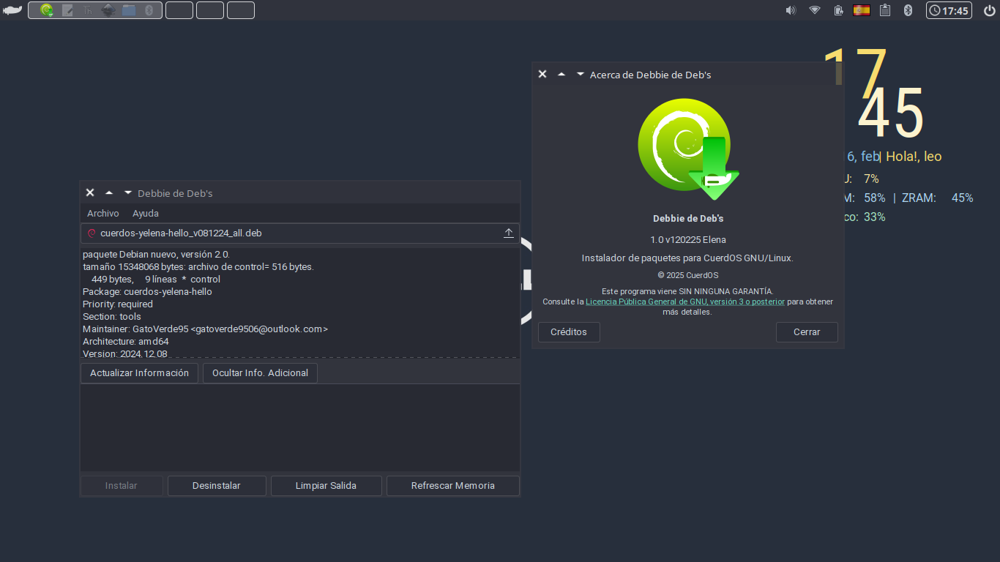

# Debbie de Deb's

<p align="center">
  
</p>
<p align="center">
  
</p>

**Debbie de Deb's** es una interfaz gráfica (GUI) para la instalación de paquetes `.deb` en sistemas basados en Debian. Es un proyecto parte del proyecto **CuerdOS GNU/Linux**. Simplifica la gestión de paquetes al proporcionar una forma intuitiva y amigable de utilizar `dpkg`. Basado en **GTK 3**, **Python**, y las herramientas de **APT** y **dpkg**.

## Características

- Interfaz sencilla y fácil de usar.
- Instalación rápida de paquetes `.deb`.
- Verificación automática de dependencias.
- Integración con `dpkg` para una gestión confiable.
- Diseño basado en **GTK 3.0**.
- Soporte para múltiples idiomas.
- Notificaciones sobre el estado de la instalación.

## Requisitos

- **Debian 12+** o cualquier derivado compatible.
- **GTK 3.0**
- **dpkg** instalado en el sistema.
- **Python 3.x**

## Instalación

Puedes clonar el repositorio y ejecutar el script:

```bash
git clone https://github.com/gatoverde95/Debbie-de-Debs.git
cd Debbie-de-Debs
python3 debbie.py
```

O bien, instalarlo manualmente:

```bash
sudo dpkg -i paquete.deb
```

Si hay dependencias faltantes, puedes solucionarlo con:

```bash
sudo apt-get install -f
```

## Uso

1. Abre la aplicación desde el menú o ejecuta `python3 debbie.py`.
2. Selecciona un archivo `.deb` y presiona **Instalar**.
3. Revisa los mensajes de salida para verificar que la instalación fue exitosa.

## Contribuir

Si deseas colaborar en el desarrollo de **Debbie-de-Debs**, síguenos en [GitHub](https://github.com/gatoverde95/Debbie-de-Debs) y envía tus **Pull Requests** o reporta errores en la sección de **Issues**.

## Licencia

Este proyecto está licenciado bajo la **GPLv3**. Puedes consultar el archivo `LICENSE` para más información.

---

> **Autor:** [gatoverde95](https://github.com/gatoverde95)  
> **Repositorio:** [Debbie-de-Debs](https://github.com/gatoverde95/Debbie-de-Debs)
